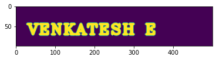
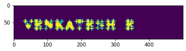
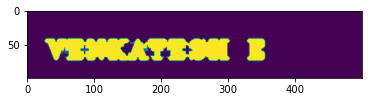

# Opening-and-Closing

# AIM:
To implement Opening and Closing using Python and OpenCV.

# SOFTWARE REQUIRED:
1. Anaconda - Python 3.7
2. OpenCV
# ALGORITHM:
1. Import the necessary packages.
2. Create the Text using cv2.putText.
3. Create the structuring element.
4. Use Opening operation.
5. Use Closing Operation.
# PROGRAM:
## Import the necessary packages:
```python
import numpy as np
import cv2
import matplotlib.pyplot as plt
```
## Create the Text using cv2.putText:
```python
img1=np.zeros((100,500),dtype='uint8')
font=cv2.FONT_HERSHEY_COMPLEX_SMALL
im=cv2.putText(img1,' Venkatesh E ',(5,70),font,2,(255),5,cv2.LINE_AA)
```
## Create the structuring element:
```python
Kernel=cv2.getStructuringElement(cv2.MORPH_CROSS,(11,11))
plt.imshow(im)
```
## Use Opening operation:
```python
image1=cv2.morphologyEx(im,cv2.MORPH_OPEN,Kernel)
plt.imshow(image1)
```
## Use Closing Operation:
```python
image1=cv2.morphologyEx(im,cv2.MORPH_CLOSE,Kernel)
plt.imshow(image1)
```
# OUTPUT:

## Display the input Image:

## Display the result of Opening:

## Display the result of Closing:

# RESULT:
Thus the Opening and Closing operation is used in the image using python and OpenCV.